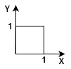
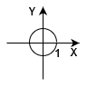

# Joint, Conditional, and Marginal Distributions

Let's start with an example:
$X, Y$: Bernoulli,

|            | Y = 0 | Y = 1  | 
|    ---     |      :-:       | :-: |
| **X = 0**  | $\frac{2}{6}$  | $\frac{1}{6}$ |
| **X = 1**  | $\frac{2}{6}$  | $\frac{1}{6}$ |

**Condition**: The numbers in the table have to be non-negative _and_ add up to 1.
Here, $\frac{2}{6} + \frac{2}{6} + \frac{1}{6} + \frac{1}{6} = 1 $

### Definitions
Assume $X, Y$ are random variables:   
- PMF: Probability Mass Function, 
- PDF: Probability Density Function (measure of probability),
- CDF: Cumulative Distribution Function
 
#### For Discrete Random Variables
**Joint CDF**: 
$$F(x, y) = P(X <= x, Y <= y)$$
**Joint PMF**: 
$$f(x, y) = P(X = x, Y = y)$$

**Marginal CDF**: 
$$F(x) = P(X <= x)$$
**Marginal PMF**: 
$$F(x) = P(X = x) = \sum_y P(X = x, Y = y)$$

#### For Continuous Random Variables
**Joint PDF**:
$$f(x, y) = \frac{\partial^2}{\partial x \partial y} F(x, y)$$
Where $F(x, y)$ is the joint CDF.
This also means: 
$$P((x, y) \in A) = {\int\int}_A \space f(x, y) dx dy$$
Where $A$ is some region in the plane.

**Marginal PDF**: 
$$f_X(x) = P(X = x) = \int^{+\infty}_{-\infty} f(x, y)dy$$
Which also means: 
$$\int^{+\infty}_{-\infty} \int^{+\infty}_{-\infty} f(x, y)dy dx = 1$$

 

### Independence 
#### Discrete
For all  $x, y \in \mathbb{R}$:
- **CDF-Wise**: $X, Y$ are independent iff   
$$P(X <= x, Y <= y) = P(X <= x) \times F(Y <= y)$$
- **PMF-Wise**: $X, Y$ are independent iff    
$$P(X = x, Y = y) = P(X = x) \times P(Y = y)$$
#### Continuous
- **PDF-Wise**: $X, Y$ are independent iff   
$$f(x, y) = f_X(x) \times f_Y(y) $$

### Conditionality

**Conditional PDF of $Y|X$**:
$$ f_{Y|X} (y|x) = \frac{f_{X,Y}(x, y)}{f_X(x)} = \frac{f_{X|Y}(x|y)f_Y(y)}{f_X(x)} $$

Think of is as the PDF where we pretend to know what $X$ is. 
i.e. Given that we know the value of $X$, what is the appropriate PDF for $Y$?

The proof for the first equality comes from conditional probability:
Say $Y$ is extremely close to $y$ (assuming probability isn't $0$), then find the conditional probability of that, given the value of $X$.
And the proof of second equality is basically **Bayes' rule**, taken at the limit.

#### Example #1
In the joint probability table provided above, are $X$ and $Y$ independent?

**Marginals**:
$$P(X = 0) = \frac{2}{6} + \frac{1}{6} = \frac{1}{2} \\
P(X = 1) = \frac{2}{6} + \frac{1}{6} = \frac{1}{2} \\
P(Y = 0) = \frac{2}{6} + \frac{2}{6} = \frac{2}{3} \\
P(Y = 1) = \frac{1}{6} + \frac{1}{6} = \frac{1}{3}$$

**Test**:
$$P(X = 0, Y = 0) = \frac{2}{6} \\
P(X=0) \times P(Y=0) = \frac{1}{2} \times \frac{2}{3} = \frac{2}{6}$$
=> (same goes for all other numbers) $X$ and $Y$ are independent.

#### Example #2
$X, Y$: Bernoulli,

|            | Y = 0 | Y = 1  | 
|    ---     |      :-:       | :-: |
| **X = 0**  | $\frac{1}{2}$  | $0$ |
| **X = 1**  | $\frac{1}{4}$  | $\frac{1}{4}$ |

$$P(X = 0) = \frac{1}{2} + 0 = \frac{1}{2} \\
P(X = 1) = \frac{1}{4} + \frac{1}{4} = \frac{1}{2} \\
P(Y = 0) = \frac{1}{4} + \frac{1}{2} = \frac{3}{4} \\
P(Y = 1) = \frac{1}{4} + 0 = \frac{1}{4} \\
P(X = 0, Y = 0) = \frac{1}{2} \neq P(X=0) \times P(Y=0) = \frac{3}{8}$$
=> $X$ and $Y$ are not independent.

#### Example #3 (continuous, independent)
Assume a uniform distribution on a square $(x, y): x, y \in [0, 1]$

The distribution is uniform, therefore the _joint PDF_ is constant (**c**) inside the square, and $0$ outside of it.
$$\int_{square} f(x, y) = \int_{square} c = c \times area |^{x=1}_{x=0} \space |^{y=1}_{y=0} = c \times 1 = 1 $$

Therefore,
$$
c = 
\begin{cases}
  1 & 0 \leq x \leq 1, & 0 \leq y \leq 1 \\
  0 & \text{otherwise}
\end{cases}
$$

$X$ and $Y$ are independent uniform, which is pretty intuitive as well. Meaning that if you pick any point in the square, both the $X$ and $Y$ will be uniformly random.

#### Example #4 (continuous, not independent)
Assume a uniform distribution inside a unit circle $(x, y): x^2 + y^2 = 1$

The distribution is uniform, therefore the _joint PDF_ is constant (**c**) inside the circle, and $0$ outside of it.

$$\int_{circle} f_{X, Y}(x, y) = \int_{circle} c = c \times \pi r^2 |^{r=1}_{r=0} = c \times \pi = 1 $$

Therefore,
$$
f_{X, Y}(x, y) = 
\begin{cases}
  \frac{1}{\pi} & x^2 + y^2 \leq 1 \\
  0 & \text{otherwise}
\end{cases}
$$

Note that in this equation's condition, $x$ and $y$ are not independent (unlike the previous example).
e.g. if $x = 0.95$, $y$ will have a much smaller allowed range of values than when $x = 0$. 
i.e. Given $X=x$, $-\sqrt{1-x^2} \leq Y \leq \sqrt{1-x^2}$

Therefore, if we want to calculate the **marginal PDF of $X$**, the only thing we have to be careful about are the bounds of the integral:

$$
f_X(x) = \int^{\sqrt{1-x^2}}_{-\sqrt{1-x^2}}\frac{1}{\pi}dy = \frac{2}{\pi}\sqrt{1-x^2}  \space \space , \space \space  -1 \leq x \leq 1
$$

Notice how the point $(x, y)$ was uniform but the marginals are **not** uniform.
Which in this case makes sense because if you look at the figure, you realize that there's a higher number of possible locations for $(x, y)$ points near $x=0$ which gives the maximum value of the marginal.

Now, if we want to calculate the **conditional PDF of $Y|X$**:

$$
f_{Y|X}(y|x) = \frac{f_{X, Y}(x, y)}{f_X(x)} = \frac{\frac{1}{\pi}}{\frac{2}{\pi} \sqrt{1-x^2}} = \frac{1}{2\sqrt{1-x^2}} \space \space , \space \space -\sqrt{1-x^2} \leq y \leq \sqrt{1-x^2}
$$

Notice how the conditional PDF of $Y|X=x$ is not dependent on the value of $Y=y$, therefore $Y$ is **uniform** given $X=x$.
i.e. 
$$Y|{X=x} \sim Uniform(-\sqrt{1-x^2} , \sqrt{1-x^2})$$

### 2-D LOTUS
Let $(X, Y)$ have joint PDF $f(x, y)$ and let $g(x, y)$ be a real-valued function of $x, y$.
Then, 
$$ \mathbb{E}[g(x, y)] = \int^{+\infty}_{-\infty} \int^{+\infty}_{-\infty} g(x, y) f(x, y) \space dx dy$$

**Theorem**: 
If $X, Y$ are independent, then 
$$\mathbb{E}(XY) = \mathbb{E}(X)\mathbb{E}(Y)$$
(Independence implies variables being uncorrelated.)

_Proof_:
Using LOTUS, $g(x, y) = xy$ and using independence, $f(x, y) = f_X(x)f_Y(y)$, then:
$$
\begin{align*}
\mathbb{E}(XY) &= \int^{+\infty}_{-\infty} \big( \int^{+\infty}_{-\infty} xy f_X(x) f_Y(y) \space dx \big) dy  \\ 
&= \int^{+\infty}_{-\infty} y f_Y(y) \int^{+\infty}_{-\infty} x f_X(x) \space dx dy \\
&= \mathbb{E}(X)\mathbb{E}(Y)
\end{align*}
$$

#### Example #5
Assume $X, Y \sim^{iid} Uniform(0, 1)$, find $\mathbb{E}[(X-Y|)$

**Solution**:
Using LOTUS,
$$
\begin{align*}
\mathbb{E}[|X-Y|] &= \int^1_0 \int^1_0 |x-y| \space dx dy \\
& = \int \int_{x \leq y} |x-y| \space dx dy + \int \int_{x \geq y} |x-y| \space dx dy \\
&= 2 \int \int_{x \leq y} |x-y| \space dx dy \\ 
&= 2 \int^1_0 \int^y_0 |x-y| \space dx dy \\
&= 2 \int^1_0 (\frac{x^2}{2} - yx) |^1_y \space dy \\ 
&= \frac{1}{3}
\end{align*}
$$

Where the first inequality is to break down the absolute value, the second equality is due to symmetry between the two cases (as $X$ and $Y$ are _iid_), and the third equality is just putting the proper limits on the integrals.

**Now, what if we want to calculate $\mathbb{E}[X+Y]$?**

We can define two different random variables,
$$ 
M = max(X, Y) \\
L = min(X, Y)
$$
(Both of these are proper random variables if you think about them long enough)
Therefore, by linearity we get:
$$
|X - Y| = M - L \\
\mathbb{E}(M - L) = \frac{1}{3} = \mathbb{E}(M) - \mathbb{E}(L) \\
\mathbb{E}(M + L) = \mathbb{E}(X + Y) = \mathbb{E}(M) + \mathbb{E}(L) = \frac{1}{2} + \frac{1}{2} = 1 \\
\Rightarrow \mathbb{E}[M] = \frac{2}{3} \space \space , \space \space \mathbb{E}[L] = \frac{1}{3}
$$

 

#### Example #6 (Chicken - Egg problem)
Suppose a chicken lays a random number of eggs, $N$, where $N \sim Pois(\lambda)$. 
Each egg independently hatches with probability $p$ and fails to hatch with probability $q = 1-p$ . Let $X$ be the number of eggs that hatch and $Y$ the number that do not hatch, so $X+Y = N$. What is the joint PMF of $X$ and $Y$?

**Solution**:
We seek the joint PMF $P(X=i,Y=j)$ for nonnegative integers $i$ and $j$. Conditional on the total number of eggs $N$, the eggs are independent Bernoulli trials with probability of success $p$, so by the story of the Binomial, the conditional distributions of $X$ and $Y$ are $X | N=n \sim Bin(n, p)$ and $Y | N=n \sim Bin(n, q)$. Since our lives would be easier if only we knew the total number of eggs, let's use wishful thinking: condition on $N$ and apply the law of total probability. 
This gives
$$
P(X=i, Y=j) = \sum_{n=0}^\infty P(X=i, Y=j | N=n) P(N=n).
$$
The sum is over all possible values of $n$, holding and fixed. But unless $n=i+j$, it is impossible for $X$ to equal $i$ and $Y$ to equal $j$. For example, the only way there can be 5 hatched eggs and 6 unhatched eggs is if there are 11 eggs in total. So
$$
P(X=i, Y=j | N=n)=0
$$
unless $n+i+j$, which means all other terms in the sum can be dropped:
$$
P(X=i,Y=j) = P(X=i, Y=j | N=i+j) P(N=i+j).
$$
Conditional on $N=i+j$, the events $X=i$ and $Y=j$ are exactly the same event, so keeping both is redundant. We'll keep $X=i$; the rest is a matter of plugging in the Binomial PMF to get and the Poisson PMF to get $P(X=i|N=i+j)$. Thus,
$$
\begin{align*}
P(X=i, Y=j) &= P(X=i | N=i+j) P(N=i+j) \\
&= {i+j \choose i} p^i q^j \cdot \frac{e^{-\lambda} \lambda^{i+j}}{(i+j)!} \\
&= \frac{e^{-\lambda p} (\lambda p)^i}{i!} \cdot \frac{e^{-\lambda q} (\lambda q)^j}{j!}.
\end{align*}
$$
The joint PMF factors into the product of the
$Pois(\lambda p)$ PMF (as a function of $i$) and the $Pois(\lambda q)$ PMF (as a function of $j$). This tells us two elegant facts: 
1. $X$ and $Y$ are independent, since their joint PMF is the product of their marginal PMFs
2. $X \sim Pois(\lambda p)$ and $Y \sim Pois(\lambda q)$

At first it may seem deeply counterintuitive that $X$ is independent of $Y$. Doesn't knowing that a lot of eggs hatched mean that there are probably not so many that didn't hatch? For a **fixed** number of eggs, this independence would be impossible: knowing the number of hatched eggs would perfectly determine the number of unhatched eggs. But in this example, the number of eggs is random, following a Poisson distribution, and this happens to be the right kind of randomness to make $X$ and $Y$ unconditionally independent (this is a special property of the Poisson). 

