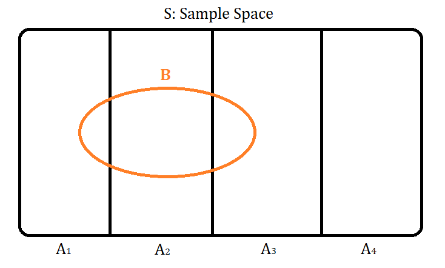

### Tips in solving problems:
1. Try simple and extreme cases: 
    * $n = 0, 1, \infty$, etc.
2. Break up the problem into simpler pieces.

### Law of Total Probability

Let $A_1, ... , A_n $ be a **partition** of $B$, then
$$P(B) = P(B \cap A_1) + ... + P(B \cap A_n) \newline = P(B|A_1)P(A_1) + ... + P(B|A_n)P(A_n)  $$

**Takeaway**: 
Conditional probability isn't just useful for updating our certainty using new evidence, it's also _useful for breaking problems into simpler pieces_; but you have to be wise in choosing $A_1, ... , A_n$, otherwise you problem will only get harder.

**Reminder**: 
A **Partition** ${A_1, ... , A_n}$ of a set, is a set of _disjoint_ subsets which when added together, will recreate the original set.

### Example #1:
Assume a random 2-card hand from the standard deck, find:
1. $P(\text{both aces | have ace})$
2. $P(\text{both aces | ace of spades})$

**Solution**:
1. 
$$
\begin{align*}
P(\text{both aces | have ace}) &= \frac{P(\text{both aces, have ace})}{P(\text{have ace})} = \frac{P(\text{both aces})}{P(\text{have ace})} = \\
&= \frac{{4 \choose 2} / {52 \choose 2}}{1 - P(\text{no ace})} = \frac{{4 \choose 2} / {52 \choose 2}}{1 {48 \choose 2} / {52 \choose 2}}
\end{align*}
$$

The first equality is because the probability of "having both aces AND an ace" is the same as the probability of having two aces, so having one ace becomes redundant.

2. We see the back of two cards. One is revealed to be the ace of spades, the other card could be any of the other aces, therefore the answer is $\frac{3}{51} = \frac{1}{17}$

**Discussion**:
_Q_: Why is the 2nd probability larger than the first?
_A_: The 1st one has a **larger prior** $P(\text{have ace})$ probability space.

### Example #2:
John gets tested for a disease that affects $1\%$ of the population and tests positive.
We say:
$$
D: \text{Patient has the disease} \\
T: \text{Patient tests positive}
$$

Suppose test is advertise as being "$95\%$ accurate" and it means:
$$
P(T|D) = 0.95 \\
P(T^c | D^c) = 0.95
$$

_Q_:
What is the probability that John *actually* has the disease?

$$
\begin{align*}
P(D|T) &= \frac{P(T|D)P(D)}{P(T)} \\
&= \frac{0.95 \times 0.01}{P(T|D)P(D) + P(T|D^c)P(D^c)} \\
&= \frac{0.95 \times 0.01}{0.95 \times 0.01 + 0.05 \times 0.99} \\
&= 0.16
\end{align*}
$$

Where we have made use of the fact that $P(T|D^c) = 1 - P(T^c|D^c)$.

**Note** that here we observe the _rarity of the disease_ and the _rarity of the false wrong test answers_ counteracting each other.

 

**Coherency of the Bayes' rule**:
Given two evidences, it doesn't matter if we update our proabilities (beliefs) by using both of them at once or one at a time. The results will be the same.

#### Biohazards:
1. Confusing $P(A|B)$ and $P(B|A)$. aka _Prosecutor's fallacy_
2. Confusing **prior** $P(A)$ with **posterior** $P(A|B)$. 
    * When we want to compute $P(A|B)$, it doesn't mean that $P(B)=1$, but rather $P(B|B) = 1$, which is always true.
3. Confusing **independence** with **conditional independence**.

**Conditional Independence**:
$$
P(A \cap B | C) = P(A|C)P(B|C)
$$

**1.** Does conditional independence imply independence? **No!**
_Example_:
Chess opponent: Conditionally independent given opponent's strength, but not independent unconditionally. (Is only dependent on your strength after you know the opponent's strength.)

**2.** Does independence imply conditional independence? **No!**
_Example_:
Event $A$: A fire alarm goes off.
Assume it's only caused by either $F$: Fire or $C$: Popcorn. Suppose $F$ and $C$ are independent, _but_ 
$$
P(F|A, C^c) = 1, \\
P(F|A^c, C) = 1 \\
\Rightarrow \text{not conditionally independent.}
$$
Something _must have_ caused the fire.

