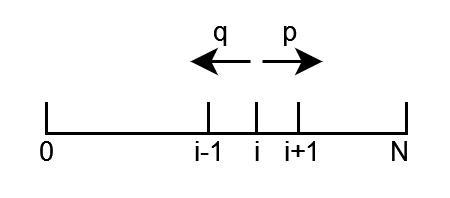

## Gambler's Ruin

Two gamblers $A$ and $B$ are playing a sequence of rounds, where in each round they bet $\$1$.
Let $p = P(A \text{ wins a round})$, and $q = 1-p$.

Find the probability that $A$ wins the entire game. (i.e. $B$ is ruined), assuming $A$ starts with $\$i$ and $B$ starts with $\$(N-i)$.

You can think of this as a random walk where $p$ is the probability of going to the right.

**Strategy**:
Condition on the first round, and note that the problem has a recursive structure.
Let $p_i = P(A \text{ wins entire game } | \, A \text{ starts at } \$i)$.
Then, by the LOTP:
$$
p_i = p \times p_{i+1} + q \times p_{i-1} , \qquad 1 \leq i \leq N-1, \qquad p_0 = 0, \, p_N = 1
$$

This equation is a **difference equation**, a discrete version of a differential equation.
Just like ODE's, we make a guess about the solution:

**Guess**:
$$
p_i = x^i
$$

Solving the equation with this guess:

$$
x^i = p x^{i+1} + q x^{i-1} \, \Rightarrow \, px^2 - x + q = 0 \\
\Rightarrow x = \frac{1 \pm \sqrt{1 - 4pq}}{\sqrt{2p}} = \frac{1 \pm (2p-1)}{\sqrt{2p}} \in \{1, \frac{q}{p} = \frac{1-p}{p} \}
$$

Writing the general solution ($x = Ax_1 + Bx_2$):
(assuming $p \neq q$)
$$
p_i = A1^i + B(\frac{q}{p})^i = A + B (\frac{q}{p})^i
$$

Checking the boundary conditions:
$$
P_0 = 0 = A + B \Rightarrow B = -A \\
P_N = 1 = A(1 - (\frac{q}{p})^N) \\
\Rightarrow 
p_i = 
\begin{cases}
  p_i = \frac{1 - (\frac{q}{p})^i}{1 - (\frac{q}{p})^N} & \text{if $p \neq q$} \\
  \frac{i}{N} & \text{if $p = q$} 
\end{cases}
$$

Proof of $p=q$ case:
Using a change of variable $x = \frac{p}{q}$ and knowing that $\frac{1-(1)^i}{1-(1)^N} = \frac{0}{0}$, we write:

$$
\lim\limits_{x \to 1} \frac{1 - x^i}{1-x^N} \stackrel{L'Hopital}{=} \frac{-i x^{i-1}}{-Nx^{N-1}} = \frac{i}{N}
$$

**Takeaway**: Since Casions (Big money players) have more money than you, they'll always win; even if the game is _just a little_ rigged in their favor.

Now, (the same thing happens in the unfair case) if we add the probabilities of A and B winning, we get $\frac{i}{N} + \frac{N-1}{N} = \frac{N}{N} = 1$.
Therefore, the probability of the game going on forever without a winner is $0$.